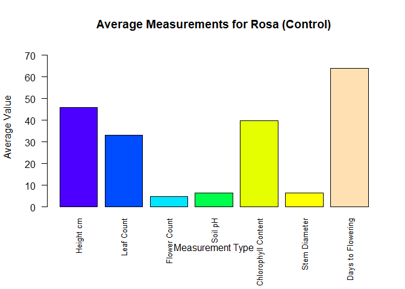
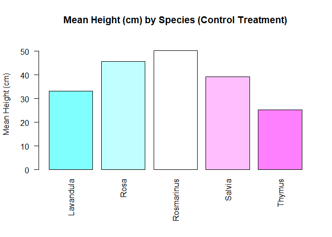
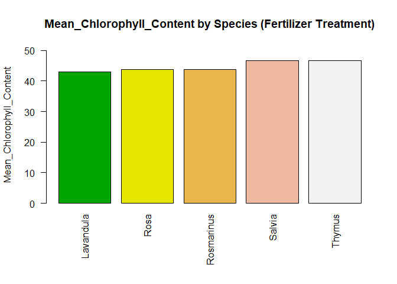
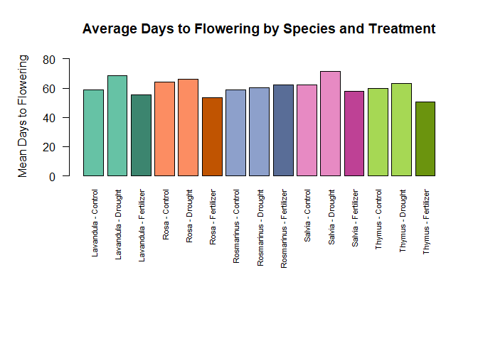

homework
================
PUNNATHORN
2025-05-07

``` r
plant_growth_data <- read.csv("plant_growth_data.csv")
head(plant_growth_data)
```

    ##   Plant_ID Species  Treatment Height_cm Leaf_Count Flower_Count Soil_pH
    ## 1        1    Rosa    Control      43.3         29            5     6.7
    ## 2        2    Rosa    Control      44.3         33            5     6.2
    ## 3        3    Rosa    Control      49.7         37            4     6.6
    ## 4        4    Rosa Fertilizer      53.2         46            6     7.2
    ## 5        5    Rosa Fertilizer      53.4         42            9     6.5
    ## 6        6    Rosa Fertilizer      58.1         48            6     6.9
    ##   Chlorophyll_Content Stem_Diameter Days_to_Flowering
    ## 1                36.8           6.6                64
    ## 2                43.8           5.9                65
    ## 3                39.0           6.7                63
    ## 4                42.4           8.9                48
    ## 5                44.3           7.0                59
    ## 6                44.4          10.7                53

``` r
library(dplyr)
```

    ## 
    ## Attaching package: 'dplyr'

    ## The following objects are masked from 'package:stats':
    ## 
    ##     filter, lag

    ## The following objects are masked from 'package:base':
    ## 
    ##     intersect, setdiff, setequal, union

``` r
library(ggplot2)
```

# คำตอบข้อที่ 1 \
##Rosa species

``` r
#เลือก species
Rosa <- filter(plant_growth_data, Species == "Rosa")
# เลือกข้อมูลในคอลัมน์ control
control.Rosa <- filter(Rosa, Treatment == "Control")
#หาค่าเฉลี่ยแต่ละ parameterเก็บไว้ในvector
Height_mean.control.Rosa<-mean(control.Rosa$Height_cm)
Leaf_Count.control.Rosa<-mean(control.Rosa$Leaf_Count)
Flower_Count.control.Rosa<-mean(control.Rosa$Flower_Count)
Soil_pH.control.Rosa<-mean(control.Rosa$Soil_pH)
Chlorophyll_Content.control.Rosa<-mean(control.Rosa$Chlorophyll_Content)
Stem_Diameter.control.Rosa<-mean(control.Rosa$Stem_Diameter)
Days_to_Flowering.control.Rosa<-mean(control.Rosa$Days_to_Flowering)
#เก็บข้อมูลค่าเฉลี่ยไว้ในvector
control_summary_of_Rosa<-c(
  Height_mean = Height_mean.control.Rosa,
  Leaf_Count = Leaf_Count.control.Rosa,
  Flower_Count = Flower_Count.control.Rosa,
  Soil_pH = Soil_pH.control.Rosa,
  Chlorophyll_Content = Chlorophyll_Content.control.Rosa,
  Stem_Diameter = Stem_Diameter.control.Rosa,
  Days_to_Flowering = Days_to_Flowering.control.Rosa
)
#แสดงผลข้อมูล
print(control_summary_of_Rosa)
```

    ##         Height_mean          Leaf_Count        Flower_Count             Soil_pH 
    ##           45.766667           33.000000            4.666667            6.500000 
    ## Chlorophyll_Content       Stem_Diameter   Days_to_Flowering 
    ##           39.866667            6.400000           64.000000

``` r
# เลือกข้อมูลในคอลัมน์  Fertilizer
Fertilizer.Rosa <- filter(Rosa, Treatment == "Fertilizer")
#หาค่าเฉลี่ยแต่ละ parameterเก็บไว้ในvector
Height_mean.Fertilizer.Rosa<-mean(Fertilizer.Rosa$Height_cm)
Leaf_Count.Fertilizer.Rosa<-mean(Fertilizer.Rosa$Leaf_Count)
Flower_Count.Fertilizer.Rosa<-mean(Fertilizer.Rosa$Flower_Count)
Soil_pH.Fertilizer.Rosa<-mean(Fertilizer.Rosa$Soil_pH)
Chlorophyll_Content.Fertilizer.Rosa<-mean(Fertilizer.Rosa$Chlorophyll_Content)
Stem_Diameter.Fertilizer.Rosa<-mean(Fertilizer.Rosa$Stem_Diameter)
Days_to_Flowering.Fertilizer.Rosa<-mean(Fertilizer.Rosa$Days_to_Flowering)
#เก็บข้อมูลค่าเฉลี่ยไว้ในvector
Fertilizer_summary_of_Rosa<-c(
  Height_mean = Height_mean.Fertilizer.Rosa,
  Leaf_Count = Leaf_Count.Fertilizer.Rosa,
  Flower_Count = Flower_Count.Fertilizer.Rosa,
  Soil_pH = Soil_pH.Fertilizer.Rosa,
  Chlorophyll_Content = Chlorophyll_Content.Fertilizer.Rosa,
  Stem_Diameter = Stem_Diameter.Fertilizer.Rosa,
  Days_to_Flowering = Days_to_Flowering.Fertilizer.Rosa
)
#แสดงผลข้อมูล
print(Fertilizer_summary_of_Rosa)
```

    ##         Height_mean          Leaf_Count        Flower_Count             Soil_pH 
    ##           54.900000           45.333333            7.000000            6.866667 
    ## Chlorophyll_Content       Stem_Diameter   Days_to_Flowering 
    ##           43.700000            8.866667           53.333333

``` r
# เลือกข้อมูลในคอลัมน์  Drought
Drought.Rosa <- filter(Rosa, Treatment == "Drought")
#หาค่าเฉลี่ยแต่ละ parameterเก็บไว้ในvector
Height_mean.Drought.Rosa<-mean(Drought.Rosa$Height_cm)
Leaf_Count.Drought.Rosa<-mean(Drought.Rosa$Leaf_Count)
Flower_Count.Drought.Rosa<-mean(Drought.Rosa$Flower_Count)
Soil_pH.Drought.Rosa<-mean(Drought.Rosa$Soil_pH)
Chlorophyll_Content.Drought.Rosa<-mean(Drought.Rosa$Chlorophyll_Content)
Stem_Diameter.Drought.Rosa<-mean(Drought.Rosa$Stem_Diameter)
Days_to_Flowering.Drought.Rosa<-mean(Drought.Rosa$Days_to_Flowering)
#เก็บข้อมูลค่าเฉลี่ยไว้ในvector
Drought_summary_of_Rosa<-c(
  Height_mean = Height_mean.Drought.Rosa,
  Leaf_Count = Leaf_Count.Drought.Rosa,
  Flower_Count = Flower_Count.Drought.Rosa,
  Soil_pH = Soil_pH.Drought.Rosa,
  Chlorophyll_Content = Chlorophyll_Content.Drought.Rosa,
  Stem_Diameter = Stem_Diameter.Drought.Rosa,
  Days_to_Flowering = Days_to_Flowering.Drought.Rosa
)
#แสดงผลข้อมูล
print(Drought_summary_of_Rosa)
```

    ##         Height_mean          Leaf_Count        Flower_Count             Soil_pH 
    ##           36.500000           31.333333            3.666667            6.166667 
    ## Chlorophyll_Content       Stem_Diameter   Days_to_Flowering 
    ##           36.966667            5.233333           66.000000

\#Lavandula species

``` r
#เลือก species
Lavandula <- filter(plant_growth_data, Species == "Lavandula")
# เลือกข้อมูลในคอลัมน์ control
control.Lavandula <- filter(Lavandula, Treatment == "Control")
#หาค่าเฉลี่ยแต่ละ parameterเก็บไว้ในvector
Height_mean.control.Lavandula<-mean(control.Lavandula$Height_cm)
Leaf_Count.control.Lavandula<-mean(control.Lavandula$Leaf_Count)
Flower_Count.control.Lavandula<-mean(control.Lavandula$Flower_Count)
Soil_pH.control.Lavandula<-mean(control.Lavandula$Soil_pH)
Chlorophyll_Content.control.Lavandula<-mean(control.Lavandula$Chlorophyll_Content)
Stem_Diameter.control.Lavandula<-mean(control.Lavandula$Stem_Diameter)
Days_to_Flowering.control.Lavandula<-mean(control.Lavandula$Days_to_Flowering)
#เก็บข้อมูลค่าเฉลี่ยไว้ในvector
control_summary_of_Lavandula<-c(
  Height_mean = Height_mean.control.Lavandula,
  Leaf_Count = Leaf_Count.control.Lavandula,
  Flower_Count = Flower_Count.control.Lavandula,
  Soil_pH = Soil_pH.control.Lavandula,
  Chlorophyll_Content = Chlorophyll_Content.control.Lavandula,
  Stem_Diameter = Stem_Diameter.control.Lavandula,
  Days_to_Flowering = Days_to_Flowering.control.Lavandula
)
#แสดงผลข้อมูล
print(control_summary_of_Lavandula)
```

    ##         Height_mean          Leaf_Count        Flower_Count             Soil_pH 
    ##           33.166667           26.000000            9.000000            6.266667 
    ## Chlorophyll_Content       Stem_Diameter   Days_to_Flowering 
    ##           39.366667            4.266667           58.666667

``` r
# เลือกข้อมูลในคอลัมน์  Fertilizer
Fertilizer.Lavandula <- filter(Lavandula, Treatment == "Fertilizer")
#หาค่าเฉลี่ยแต่ละ parameterเก็บไว้ในvector
Height_mean.Fertilizer.Lavandula<-mean(Fertilizer.Lavandula$Height_cm)
Leaf_Count.Fertilizer.Lavandula<-mean(Fertilizer.Lavandula$Leaf_Count)
Flower_Count.Fertilizer.Lavandula<-mean(Fertilizer.Lavandula$Flower_Count)
Soil_pH.Fertilizer.Lavandula<-mean(Fertilizer.Lavandula$Soil_pH)
Chlorophyll_Content.Fertilizer.Lavandula<-mean(Fertilizer.Lavandula$Chlorophyll_Content)
Stem_Diameter.Fertilizer.Lavandula<-mean(Fertilizer.Lavandula$Stem_Diameter)
Days_to_Flowering.Fertilizer.Lavandula<-mean(Fertilizer.Lavandula$Days_to_Flowering)
#เก็บข้อมูลค่าเฉลี่ยไว้ในvector
Fertilizer_summary_of_Lavandula<-c(
  Height_mean = Height_mean.Fertilizer.Lavandula,
  Leaf_Count = Leaf_Count.Fertilizer.Lavandula,
  Flower_Count = Flower_Count.Fertilizer.Lavandula,
  Soil_pH = Soil_pH.Fertilizer.Lavandula,
  Chlorophyll_Content = Chlorophyll_Content.Fertilizer.Lavandula,
  Stem_Diameter = Stem_Diameter.Fertilizer.Lavandula,
  Days_to_Flowering = Days_to_Flowering.Fertilizer.Lavandula
)
#แสดงผลข้อมูล
print(Fertilizer_summary_of_Lavandula)
```

    ##         Height_mean          Leaf_Count        Flower_Count             Soil_pH 
    ##           39.933333           33.666667           12.333333            6.866667 
    ## Chlorophyll_Content       Stem_Diameter   Days_to_Flowering 
    ##           42.900000            6.000000           55.666667

``` r
# เลือกข้อมูลในคอลัมน์  Drought
Drought.Lavandula <- filter(Lavandula, Treatment == "Drought")
#หาค่าเฉลี่ยแต่ละ parameterเก็บไว้ในvector
Height_mean.Drought.Lavandula<-mean(Drought.Lavandula$Height_cm)
Leaf_Count.Drought.Lavandula<-mean(Drought.Lavandula$Leaf_Count)
Flower_Count.Drought.Lavandula<-mean(Drought.Lavandula$Flower_Count)
Soil_pH.Drought.Lavandula<-mean(Drought.Lavandula$Soil_pH)
Chlorophyll_Content.Drought.Lavandula<-mean(Drought.Lavandula$Chlorophyll_Content)
Stem_Diameter.Drought.Lavandula<-mean(Drought.Lavandula$Stem_Diameter)
Days_to_Flowering.Drought.Lavandula<-mean(Drought.Lavandula$Days_to_Flowering)
#เก็บข้อมูลค่าเฉลี่ยไว้ในvector
Drought_summary_of_Lavandula<-c(
  Height_mean = Height_mean.Drought.Lavandula,
  Leaf_Count = Leaf_Count.Drought.Lavandula,
  Flower_Count = Flower_Count.Drought.Lavandula,
  Soil_pH = Soil_pH.Drought.Lavandula,
  Chlorophyll_Content = Chlorophyll_Content.Drought.Lavandula,
  Stem_Diameter = Stem_Diameter.Drought.Lavandula,
  Days_to_Flowering = Days_to_Flowering.Drought.Lavandula
)
#แสดงผลข้อมูล
print(Drought_summary_of_Lavandula)
```

    ##         Height_mean          Leaf_Count        Flower_Count             Soil_pH 
    ##           25.333333           19.666667            6.666667            6.566667 
    ## Chlorophyll_Content       Stem_Diameter   Days_to_Flowering 
    ##           36.333333            3.900000           68.333333

\##Salvia species

``` r
#เลือก species
Salvia <- filter(plant_growth_data, Species == "Salvia")
# เลือกข้อมูลในคอลัมน์ control
control.Salvia <- filter(Salvia, Treatment == "Control")
#หาค่าเฉลี่ยแต่ละ parameterเก็บไว้ในvector
Height_mean.control.Salvia<-mean(control.Salvia$Height_cm)
Leaf_Count.control.Salvia<-mean(control.Salvia$Leaf_Count)
Flower_Count.control.Salvia<-mean(control.Salvia$Flower_Count)
Soil_pH.control.Salvia<-mean(control.Salvia$Soil_pH)
Chlorophyll_Content.control.Salvia<-mean(control.Salvia$Chlorophyll_Content)
Stem_Diameter.control.Salvia<-mean(control.Salvia$Stem_Diameter)
Days_to_Flowering.control.Salvia<-mean(control.Salvia$Days_to_Flowering)
#เก็บข้อมูลค่าเฉลี่ยไว้ในvector
control_summary_of_Salvia<-c(
  Height_mean = Height_mean.control.Salvia,
  Leaf_Count = Leaf_Count.control.Salvia,
  Flower_Count = Flower_Count.control.Salvia,
  Soil_pH = Soil_pH.control.Salvia,
  Chlorophyll_Content = Chlorophyll_Content.control.Salvia,
  Stem_Diameter = Stem_Diameter.control.Salvia,
  Days_to_Flowering = Days_to_Flowering.control.Salvia
)
#แสดงผลข้อมูล
print(control_summary_of_Salvia)
```

    ##         Height_mean          Leaf_Count        Flower_Count             Soil_pH 
    ##           39.166667           28.666667            7.666667            6.400000 
    ## Chlorophyll_Content       Stem_Diameter   Days_to_Flowering 
    ##           40.400000            6.066667           62.000000

``` r
# เลือกข้อมูลในคอลัมน์  Fertilizer
Fertilizer.Salvia <- filter(Salvia, Treatment == "Fertilizer")
#หาค่าเฉลี่ยแต่ละ parameterเก็บไว้ในvector
Height_mean.Fertilizer.Salvia<-mean(Fertilizer.Salvia$Height_cm)
Leaf_Count.Fertilizer.Salvia<-mean(Fertilizer.Salvia$Leaf_Count)
Flower_Count.Fertilizer.Salvia<-mean(Fertilizer.Salvia$Flower_Count)
Soil_pH.Fertilizer.Salvia<-mean(Fertilizer.Salvia$Soil_pH)
Chlorophyll_Content.Fertilizer.Salvia<-mean(Fertilizer.Salvia$Chlorophyll_Content)
Stem_Diameter.Fertilizer.Salvia<-mean(Fertilizer.Salvia$Stem_Diameter)
Days_to_Flowering.Fertilizer.Salvia<-mean(Fertilizer.Salvia$Days_to_Flowering)
#เก็บข้อมูลค่าเฉลี่ยไว้ในvector
Fertilizer_summary_of_Salvia<-c(
  Height_mean = Height_mean.Fertilizer.Salvia,
  Leaf_Count = Leaf_Count.Fertilizer.Salvia,
  Flower_Count = Flower_Count.Fertilizer.Salvia,
  Soil_pH = Soil_pH.Fertilizer.Salvia,
  Chlorophyll_Content = Chlorophyll_Content.Fertilizer.Salvia,
  Stem_Diameter = Stem_Diameter.Fertilizer.Salvia,
  Days_to_Flowering = Days_to_Flowering.Fertilizer.Salvia
)
#แสดงผลข้อมูล
print(Fertilizer_summary_of_Salvia)
```

    ##         Height_mean          Leaf_Count        Flower_Count             Soil_pH 
    ##           46.000000           39.000000           10.666667            6.866667 
    ## Chlorophyll_Content       Stem_Diameter   Days_to_Flowering 
    ##           46.566667            6.200000           57.666667

``` r
# เลือกข้อมูลในคอลัมน์  Drought
Drought.Salvia <- filter(Salvia, Treatment == "Drought")
#หาค่าเฉลี่ยแต่ละ parameterเก็บไว้ในvector
Height_mean.Drought.Salvia<-mean(Drought.Salvia$Height_cm)
Leaf_Count.Drought.Salvia<-mean(Drought.Salvia$Leaf_Count)
Flower_Count.Drought.Salvia<-mean(Drought.Salvia$Flower_Count)
Soil_pH.Drought.Salvia<-mean(Drought.Salvia$Soil_pH)
Chlorophyll_Content.Drought.Salvia<-mean(Drought.Salvia$Chlorophyll_Content)
Stem_Diameter.Drought.Salvia<-mean(Drought.Salvia$Stem_Diameter)
Days_to_Flowering.Drought.Salvia<-mean(Drought.Salvia$Days_to_Flowering)
#เก็บข้อมูลค่าเฉลี่ยไว้ในvector
Drought_summary_of_Salvia<-c(
  Height_mean = Height_mean.Drought.Salvia,
  Leaf_Count = Leaf_Count.Drought.Salvia,
  Flower_Count = Flower_Count.Drought.Salvia,
  Soil_pH = Soil_pH.Drought.Salvia,
  Chlorophyll_Content = Chlorophyll_Content.Drought.Salvia,
  Stem_Diameter = Stem_Diameter.Drought.Salvia,
  Days_to_Flowering = Days_to_Flowering.Drought.Salvia
)
#แสดงผลข้อมูล
print(Drought_summary_of_Salvia)
```

    ##         Height_mean          Leaf_Count        Flower_Count             Soil_pH 
    ##           31.500000           24.000000            6.333333            6.366667 
    ## Chlorophyll_Content       Stem_Diameter   Days_to_Flowering 
    ##           33.333333            4.600000           71.333333

\##Thymus species

``` r
#เลือก species
Thymus <- filter(plant_growth_data, Species == "Thymus")
# เลือกข้อมูลในคอลัมน์ control
control.Thymus <- filter(Thymus, Treatment == "Control")
#หาค่าเฉลี่ยแต่ละ parameterเก็บไว้ในvector
Height_mean.control.Thymus<-mean(control.Thymus$Height_cm)
Leaf_Count.control.Thymus<-mean(control.Thymus$Leaf_Count)
Flower_Count.control.Thymus<-mean(control.Thymus$Flower_Count)
Soil_pH.control.Thymus<-mean(control.Thymus$Soil_pH)
Chlorophyll_Content.control.Thymus<-mean(control.Thymus$Chlorophyll_Content)
Stem_Diameter.control.Thymus<-mean(control.Thymus$Stem_Diameter)
Days_to_Flowering.control.Thymus<-mean(control.Thymus$Days_to_Flowering)
#เก็บข้อมูลค่าเฉลี่ยไว้ในvector
control_summary_of_Thymus<-c(
  Height_mean = Height_mean.control.Thymus,
  Leaf_Count = Leaf_Count.control.Thymus,
  Flower_Count = Flower_Count.control.Thymus,
  Soil_pH = Soil_pH.control.Thymus,
  Chlorophyll_Content = Chlorophyll_Content.control.Thymus,
  Stem_Diameter = Stem_Diameter.control.Thymus,
  Days_to_Flowering = Days_to_Flowering.control.Thymus
)
#แสดงผลข้อมูล
print(control_summary_of_Thymus)
```

    ##         Height_mean          Leaf_Count        Flower_Count             Soil_pH 
    ##           25.300000           19.666667           13.666667            6.566667 
    ## Chlorophyll_Content       Stem_Diameter   Days_to_Flowering 
    ##           41.000000            4.233333           59.666667

``` r
# เลือกข้อมูลในคอลัมน์  Fertilizer
Fertilizer.Thymus <- filter(Thymus, Treatment == "Fertilizer")
#หาค่าเฉลี่ยแต่ละ parameterเก็บไว้ในvector
Height_mean.Fertilizer.Thymus<-mean(Fertilizer.Thymus$Height_cm)
Leaf_Count.Fertilizer.Thymus<-mean(Fertilizer.Thymus$Leaf_Count)
Flower_Count.Fertilizer.Thymus<-mean(Fertilizer.Thymus$Flower_Count)
Soil_pH.Fertilizer.Thymus<-mean(Fertilizer.Thymus$Soil_pH)
Chlorophyll_Content.Fertilizer.Thymus<-mean(Fertilizer.Thymus$Chlorophyll_Content)
Stem_Diameter.Fertilizer.Thymus<-mean(Fertilizer.Thymus$Stem_Diameter)
Days_to_Flowering.Fertilizer.Thymus<-mean(Fertilizer.Thymus$Days_to_Flowering)
#เก็บข้อมูลค่าเฉลี่ยไว้ในvector
Fertilizer_summary_of_Thymus<-c(
  Height_mean = Height_mean.Fertilizer.Thymus,
  Leaf_Count = Leaf_Count.Fertilizer.Thymus,
  Flower_Count = Flower_Count.Fertilizer.Thymus,
  Soil_pH = Soil_pH.Fertilizer.Thymus,
  Chlorophyll_Content = Chlorophyll_Content.Fertilizer.Thymus,
  Stem_Diameter = Stem_Diameter.Fertilizer.Thymus,
  Days_to_Flowering = Days_to_Flowering.Fertilizer.Thymus
)
#แสดงผลข้อมูล
print(Fertilizer_summary_of_Thymus)
```

    ##         Height_mean          Leaf_Count        Flower_Count             Soil_pH 
    ##           34.033333           26.333333           17.333333            6.833333 
    ## Chlorophyll_Content       Stem_Diameter   Days_to_Flowering 
    ##           46.600000            5.666667           50.666667

``` r
# เลือกข้อมูลในคอลัมน์  Drought
Drought.Thymus <- filter(Thymus, Treatment == "Drought")
#หาค่าเฉลี่ยแต่ละ parameterเก็บไว้ในvector
Height_mean.Drought.Thymus<-mean(Drought.Thymus$Height_cm)
Leaf_Count.Drought.Thymus<-mean(Drought.Thymus$Leaf_Count)
Flower_Count.Drought.Thymus<-mean(Drought.Thymus$Flower_Count)
Soil_pH.Drought.Thymus<-mean(Drought.Thymus$Soil_pH)
Chlorophyll_Content.Drought.Thymus<-mean(Drought.Thymus$Chlorophyll_Content)
Stem_Diameter.Drought.Thymus<-mean(Drought.Thymus$Stem_Diameter)
Days_to_Flowering.Drought.Thymus<-mean(Drought.Thymus$Days_to_Flowering)
#เก็บข้อมูลค่าเฉลี่ยไว้ในvector
Drought_summary_of_Thymus<-c(
  Height_mean = Height_mean.Drought.Thymus,
  Leaf_Count = Leaf_Count.Drought.Thymus,
  Flower_Count = Flower_Count.Drought.Thymus,
  Soil_pH = Soil_pH.Drought.Thymus,
  Chlorophyll_Content = Chlorophyll_Content.Drought.Thymus,
  Stem_Diameter = Stem_Diameter.Drought.Thymus,
  Days_to_Flowering = Days_to_Flowering.Drought.Thymus
)
#แสดงผลข้อมูล
print(Drought_summary_of_Thymus)
```

    ##         Height_mean          Leaf_Count        Flower_Count             Soil_pH 
    ##           20.400000           16.333333           13.666667            6.466667 
    ## Chlorophyll_Content       Stem_Diameter   Days_to_Flowering 
    ##           35.166667            2.333333           63.333333

\##Rosmarinus species

``` r
#เลือก species
Rosmarinus <- filter(plant_growth_data, Species == "Rosmarinus")
# เลือกข้อมูลในคอลัมน์ control
control.Rosmarinus <- filter(Rosmarinus, Treatment == "Control")
#หาค่าเฉลี่ยแต่ละ parameterเก็บไว้ในvector
Height_mean.control.Rosmarinus<-mean(control.Rosmarinus$Height_cm)
Leaf_Count.control.Rosmarinus<-mean(control.Rosmarinus$Leaf_Count)
Flower_Count.control.Rosmarinus<-mean(control.Rosmarinus$Flower_Count)
Soil_pH.control.Rosmarinus<-mean(control.Rosmarinus$Soil_pH)
Chlorophyll_Content.control.Rosmarinus<-mean(control.Rosmarinus$Chlorophyll_Content)
Stem_Diameter.control.Rosmarinus<-mean(control.Rosmarinus$Stem_Diameter)
Days_to_Flowering.control.Rosmarinus<-mean(control.Rosmarinus$Days_to_Flowering)
#เก็บข้อมูลค่าเฉลี่ยไว้ในvector
control_summary_of_Rosmarinus<-c(
  Height_mean = Height_mean.control.Rosmarinus,
  Leaf_Count = Leaf_Count.control.Rosmarinus,
  Flower_Count = Flower_Count.control.Rosmarinus,
  Soil_pH = Soil_pH.control.Rosmarinus,
  Chlorophyll_Content = Chlorophyll_Content.control.Rosmarinus,
  Stem_Diameter = Stem_Diameter.control.Rosmarinus,
  Days_to_Flowering = Days_to_Flowering.control.Rosmarinus
)
#แสดงผลข้อมูล
print(control_summary_of_Rosmarinus)
```

    ##         Height_mean          Leaf_Count        Flower_Count             Soil_pH 
    ##           50.200000           41.333333            5.666667            6.633333 
    ## Chlorophyll_Content       Stem_Diameter   Days_to_Flowering 
    ##           37.600000            7.833333           59.000000

``` r
# เลือกข้อมูลในคอลัมน์  Fertilizer
Fertilizer.Rosmarinus <- filter(Rosmarinus, Treatment == "Fertilizer")
#หาค่าเฉลี่ยแต่ละ parameterเก็บไว้ในvector
Height_mean.Fertilizer.Rosmarinus<-mean(Fertilizer.Rosmarinus$Height_cm)
Leaf_Count.Fertilizer.Rosmarinus<-mean(Fertilizer.Rosmarinus$Leaf_Count)
Flower_Count.Fertilizer.Rosmarinus<-mean(Fertilizer.Rosmarinus$Flower_Count)
Soil_pH.Fertilizer.Rosmarinus<-mean(Fertilizer.Rosmarinus$Soil_pH)
Chlorophyll_Content.Fertilizer.Rosmarinus<-mean(Fertilizer.Rosmarinus$Chlorophyll_Content)
Stem_Diameter.Fertilizer.Rosmarinus<-mean(Fertilizer.Rosmarinus$Stem_Diameter)
Days_to_Flowering.Fertilizer.Rosmarinus<-mean(Fertilizer.Rosmarinus$Days_to_Flowering)
#เก็บข้อมูลค่าเฉลี่ยไว้ในvector
Fertilizer_summary_of_Rosmarinus<-c(
  Height_mean = Height_mean.Fertilizer.Rosmarinus,
  Leaf_Count = Leaf_Count.Fertilizer.Rosmarinus,
  Flower_Count = Flower_Count.Fertilizer.Rosmarinus,
  Soil_pH = Soil_pH.Fertilizer.Rosmarinus,
  Chlorophyll_Content = Chlorophyll_Content.Fertilizer.Rosmarinus,
  Stem_Diameter = Stem_Diameter.Fertilizer.Rosmarinus,
  Days_to_Flowering = Days_to_Flowering.Fertilizer.Rosmarinus
)
#แสดงผลข้อมูล
print(Fertilizer_summary_of_Rosmarinus)
```

    ##         Height_mean          Leaf_Count        Flower_Count             Soil_pH 
    ##           56.733333           47.000000           10.000000            6.700000 
    ## Chlorophyll_Content       Stem_Diameter   Days_to_Flowering 
    ##           43.766667            9.733333           62.000000

``` r
# เลือกข้อมูลในคอลัมน์  Drought
Drought.Rosmarinus <- filter(Rosmarinus, Treatment == "Drought")
#หาค่าเฉลี่ยแต่ละ parameterเก็บไว้ในvector
Height_mean.Drought.Rosmarinus<-mean(Drought.Rosmarinus$Height_cm)
Leaf_Count.Drought.Rosmarinus<-mean(Drought.Rosmarinus$Leaf_Count)
Flower_Count.Drought.Rosmarinus<-mean(Drought.Rosmarinus$Flower_Count)
Soil_pH.Drought.Rosmarinus<-mean(Drought.Rosmarinus$Soil_pH)
Chlorophyll_Content.Drought.Rosmarinus<-mean(Drought.Rosmarinus$Chlorophyll_Content)
Stem_Diameter.Drought.Rosmarinus<-mean(Drought.Rosmarinus$Stem_Diameter)
Days_to_Flowering.Drought.Rosmarinus<-mean(Drought.Rosmarinus$Days_to_Flowering)
#เก็บข้อมูลค่าเฉลี่ยไว้ในvector
Drought_summary_of_Rosmarinus<-c(
  Height_mean = Height_mean.Drought.Rosmarinus,
  Leaf_Count = Leaf_Count.Drought.Rosmarinus,
  Flower_Count = Flower_Count.Drought.Rosmarinus,
  Soil_pH = Soil_pH.Drought.Rosmarinus,
  Chlorophyll_Content = Chlorophyll_Content.Drought.Rosmarinus,
  Stem_Diameter = Stem_Diameter.Drought.Rosmarinus,
  Days_to_Flowering = Days_to_Flowering.Drought.Rosmarinus
)
#แสดงผลข้อมูล
print(Drought_summary_of_Rosmarinus)
```

    ##         Height_mean          Leaf_Count        Flower_Count             Soil_pH 
    ##           45.100000           38.333333            2.666667            6.433333 
    ## Chlorophyll_Content       Stem_Diameter   Days_to_Flowering 
    ##           36.433333            6.066667           60.333333

# คำตอบข้อที่ 2

``` r
summary_plant_data <- plant_growth_data %>%
  group_by(Species, Treatment) %>%
  summarise(
    Mean_Height_cm = mean(Height_cm, na.rm = TRUE),
    Mean_Leaf_Count = mean(Leaf_Count, na.rm = TRUE),
    Mean_Flower_Count =mean(Flower_Count, na.rm = TRUE),
    Mean_Soil_pH = mean(Soil_pH, na.rm = TRUE),
    Mean_Chlorophyll_Content = mean(Chlorophyll_Content, na.rm = TRUE),
    Mean_Stem_Diameter = mean(Stem_Diameter, na.rm = TRUE),
    Mean_Days_to_Flowering = mean(Days_to_Flowering, na.rm = TRUE),
    .groups = 'drop'  
    )

print(head(summary_plant_data))
```

    ## # A tibble: 6 × 9
    ##   Species   Treatment  Mean_Height_cm Mean_Leaf_Count Mean_Flower_Count
    ##   <chr>     <chr>               <dbl>           <dbl>             <dbl>
    ## 1 Lavandula Control              33.2            26                9   
    ## 2 Lavandula Drought              25.3            19.7              6.67
    ## 3 Lavandula Fertilizer           39.9            33.7             12.3 
    ## 4 Rosa      Control              45.8            33                4.67
    ## 5 Rosa      Drought              36.5            31.3              3.67
    ## 6 Rosa      Fertilizer           54.9            45.3              7   
    ## # ℹ 4 more variables: Mean_Soil_pH <dbl>, Mean_Chlorophyll_Content <dbl>,
    ## #   Mean_Stem_Diameter <dbl>, Mean_Days_to_Flowering <dbl>

# คำตอบข้อที่ 3

``` r
#กรองเหลือเฉพาะ Rosa/control
Rosa_con<- subset(summary_plant_data, Species == "Rosa" & Treatment == "Control")

print(Rosa_con)
```

    ## # A tibble: 1 × 9
    ##   Species Treatment Mean_Height_cm Mean_Leaf_Count Mean_Flower_Count
    ##   <chr>   <chr>              <dbl>           <dbl>             <dbl>
    ## 1 Rosa    Control             45.8              33              4.67
    ## # ℹ 4 more variables: Mean_Soil_pH <dbl>, Mean_Chlorophyll_Content <dbl>,
    ## #   Mean_Stem_Diameter <dbl>, Mean_Days_to_Flowering <dbl>

``` r
#เก็บข้อมูลไว้ในvector
cols_to_pl <- c("Mean_Height_cm", "Mean_Leaf_Count", "Mean_Flower_Count",
                  "Mean_Soil_pH", "Mean_Chlorophyll_Content",
                  "Mean_Stem_Diameter", "Mean_Days_to_Flowering")
#แปลงเป็น numeric ใช้ unlist
plot_values <- unlist(Rosa_con[1, cols_to_pl])

#สร้างชื่อสำหรับแกน X ของกราฟแท่ง
bar_names <- gsub("Mean_", "", names(plot_values)) # ลบ "Mean_" ออกจากชื่อ
bar_names <- gsub("_", " ", bar_names)            # แทนที่ "_" ด้วยช่องว่าง

#สร้างกราฟแท่ง
#ปรับขนาดของ margin ด้านล่างเพื่อให้ชื่อแกน X ไม่ชนกัน
#mar = c(bottom, left, top, right): กำหนดขนาดของขอบ (margin)
par(mar = c(7, 4, 4, 2) + 0.1)

bar_positions <- barplot(plot_values,
                         names.arg = bar_names,
                         main = "Average Measurements for Rosa (Control)",
                         xlab = "Measurement Type",
                         ylab = "Average Value",
                         col = topo.colors(length(plot_values)), # เพิ่มสี
                         las = 2, # ทำให้ชื่อแกน X ตั้งฉากกับแกน (อ่านง่ายขึ้น)
                         cex.names = 0.8, #ปรับขนาดตัวอักษรของชื่อแกน X ให้เล็กลง (80% ของขนาดปกติ)
                         ylim = c(0, max(plot_values, na.rm = TRUE) * 1.15) #กำหนดช่วงค่าของแกน y เริ่มจาก 0
                        )
```

<!-- -->
# คำตอบข้อที 4

``` r
#subset control
subset_control_plant <- summary_plant_data[summary_plant_data$Treatment == "Control", ]
#subset เฉพาะ Species, Treatment, Mean_Height_cm
final_subset_plant <- subset_control_plant[, c("Species", "Treatment", "Mean_Height_cm")]

print(final_subset_plant)
```

    ## # A tibble: 5 × 3
    ##   Species    Treatment Mean_Height_cm
    ##   <chr>      <chr>              <dbl>
    ## 1 Lavandula  Control             33.2
    ## 2 Rosa       Control             45.8
    ## 3 Rosmarinus Control             50.2
    ## 4 Salvia     Control             39.2
    ## 5 Thymus     Control             25.3

``` r
#เก็บข้อมูลไว้ใน vector
heights <- final_subset_plant$Mean_Height_cm
species_names <- final_subset_plant$Species

# 2. สร้าง barplot
# กำหนดค่า ylim เพื่อให้มีที่ว่างสำหรับตัวเลขบนแท่งกราฟ (ถ้าต้องการใส่)
max_y_value <- max(heights) * 1.1 # เพิ่ม 10% จากค่าสูงสุด
par(mar = c(7, 4, 4, 2) + 0.1)
# สร้างกราฟ
bar_positions <- barplot(heights, # ความสูงของแต่ละแท่ง
                         names.arg = species_names, # ชื่อของแต่ละแท่ง (แกน X)
                         main = "Mean Height (cm) by Species (Control Treatment)", # ชื่อกราฟ
                         #xlab = "Species", # ชื่อแกน X
                         ylab = "Mean Height (cm)", # ชื่อแกน Y
                         col = cm.colors(length(species_names)), # ใส่สีสันให้แต่ละแท่ง
                         ylim = c(0, max_y_value), # กำหนดช่วงของแกน Y
                         las = 2)
```

<!-- -->
# คำตอบข้อที 5

``` r
#subset fertilizer
subset_fertilizer_plant <- summary_plant_data[summary_plant_data$Treatment == "Fertilizer", ]
#subset เฉพาะ Species, Treatment, Mean_Chlorophyll_Content
final_subset_fplant <- subset_fertilizer_plant[, c("Species", "Treatment", "Mean_Chlorophyll_Content")]

print(final_subset_fplant)
```

    ## # A tibble: 5 × 3
    ##   Species    Treatment  Mean_Chlorophyll_Content
    ##   <chr>      <chr>                         <dbl>
    ## 1 Lavandula  Fertilizer                     42.9
    ## 2 Rosa       Fertilizer                     43.7
    ## 3 Rosmarinus Fertilizer                     43.8
    ## 4 Salvia     Fertilizer                     46.6
    ## 5 Thymus     Fertilizer                     46.6

``` r
#เก็บข้อมูลไว้ใน vector
heights_2 <- final_subset_fplant$Mean_Chlorophyll_Content
species_names <- final_subset_fplant$Species
# 2. สร้าง barplot
# กำหนดค่า ylim เพื่อให้มีที่ว่างสำหรับตัวเลขบนแท่งกราฟ (ถ้าต้องการใส่)
max_y_value <- max(heights_2) * 1.1 # เพิ่ม 10% จากค่าสูงสุด
par(mar = c(7, 4, 4, 2) + 0.1)
# สร้างกราฟ
bar_positions <- barplot(heights_2, # ความสูงของแต่ละแท่ง
                         names.arg = species_names, # ชื่อของแต่ละแท่ง (แกน X)
                         main = "Mean_Chlorophyll_Content by Species (Fertilizer Treatment)", # ชื่อกราฟ
                         #xlab = "Species", # ชื่อแกน X
                         ylab = "Mean_Chlorophyll_Content", # ชื่อแกน Y
                         col = terrain.colors(length(species_names)), # ใส่สีสันให้แต่ละแท่ง
                         ylim = c(0, max_y_value), # กำหนดช่วงของแกน Y
                         las = 2)
```

<!-- -->
# คำตอบข้อที 6

``` r
subset_end_plant <- summary_plant_data[,c("Species", "Treatment", "Mean_Days_to_Flowering")]

print(subset_end_plant)
```

    ## # A tibble: 15 × 3
    ##    Species    Treatment  Mean_Days_to_Flowering
    ##    <chr>      <chr>                       <dbl>
    ##  1 Lavandula  Control                      58.7
    ##  2 Lavandula  Drought                      68.3
    ##  3 Lavandula  Fertilizer                   55.7
    ##  4 Rosa       Control                      64  
    ##  5 Rosa       Drought                      66  
    ##  6 Rosa       Fertilizer                   53.3
    ##  7 Rosmarinus Control                      59  
    ##  8 Rosmarinus Drought                      60.3
    ##  9 Rosmarinus Fertilizer                   62  
    ## 10 Salvia     Control                      62  
    ## 11 Salvia     Drought                      71.3
    ## 12 Salvia     Fertilizer                   57.7
    ## 13 Thymus     Control                      59.7
    ## 14 Thymus     Drought                      63.3
    ## 15 Thymus     Fertilizer                   50.7

``` r
subset_end_plant<- subset_end_plant[order(subset_end_plant$Species, subset_end_plant$Treatment), ]

# 1. เตรียมข้อมูลสำหรับ barplot
heights <- subset_end_plant$Mean_Days_to_Flowering
bar_labels <- paste(subset_end_plant$Species, subset_end_plant$Treatment, sep = " - ")

# 2. กำหนดสีสำหรับแต่ละ Species
# สร้าง list ของสีพื้นฐานสำหรับแต่ละ Species ที่ไม่ซ้ำกัน
unique_species <- unique(subset_end_plant$Species)
species_colors_base <- RColorBrewer::brewer.pal(n = max(3, length(unique_species)), name = "Set2")
# หากมี Species มากกว่าจำนวนสีใน palette ให้เพิ่มสีเอง หรือใช้ palette อื่น
if (length(unique_species) > length(species_colors_base)) {
  species_colors_base <- rep(species_colors_base, length.out = length(unique_species)) # ทำซ้ำสีถ้าไม่พอ
}

# สร้างเวกเตอร์สีสำหรับแต่ละแท่ง
bar_colors <- character(nrow(subset_end_plant))
treatments_per_species <- table(subset_end_plant$Species)


for (i in seq_along(unique_species)) {
  current_species <- unique_species[i]
  base_color_for_species <- species_colors_base[i]
  
  # หาจำนวน treatment ของ species ปัจจุบัน
  num_treatments <- treatments_per_species[current_species]
  
  # สร้างเฉดสีสำหรับ spe
  # หากมี treatment เดียว ก็ใช้สีพื้นฐาน
  if (num_treatments == 1) {
    shades_for_species <- base_color_for_species
  } else {
    color_func <- colorRampPalette(c(scales::alpha(base_color_for_species, 0.4), # อ่อน
                                     base_color_for_species,                      # กลาง
                                     colorspace::darken(base_color_for_species, 0.3))) # เข้ม
    if (num_treatments > 1) {
        shades_for_species <- color_func(num_treatments)
    } else {
        shades_for_species <- base_color_for_species
    }

  }
  
  # กำหนดสีให้กับแถวที่ตรงกับ species และ treatment
  bar_colors[subset_end_plant$Species == current_species] <- shades_for_species
}


#ปรับ margin
op <- par(no.readonly = TRUE)
par(mar = c(12, 5, 4, 2) + 0.1) # เพิ่ม bottom margin

#สร้างกราฟแท่ง
bar_positions <- barplot(
  heights,
  names.arg = bar_labels,
  main = "Average Days to Flowering by Species and Treatment",
  ylab = "Mean Days to Flowering",
  col = bar_colors,
  las = 2,
  cex.names = 0.7,
  ylim = c(0, max(heights, na.rm = TRUE) * 1.15)
)
```

<!-- -->
