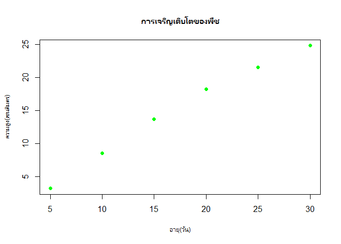
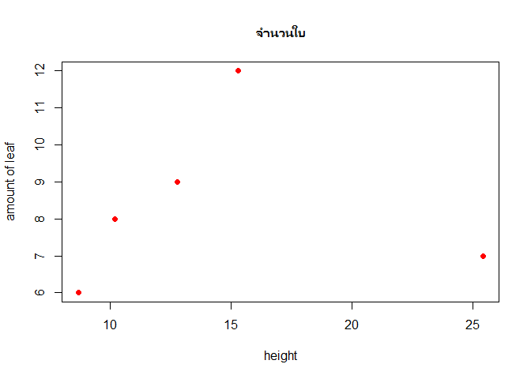
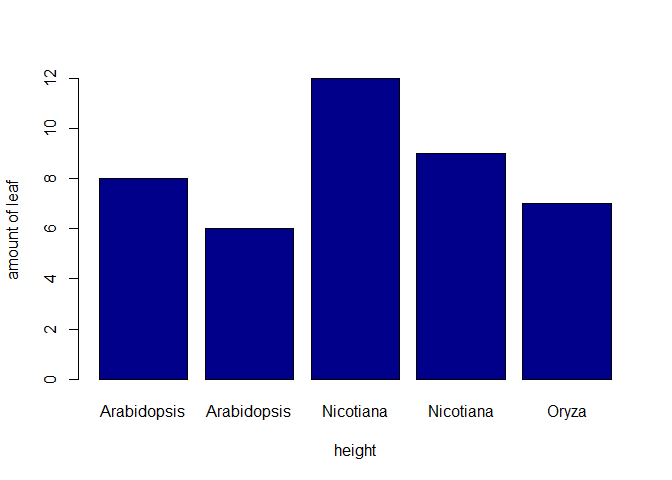
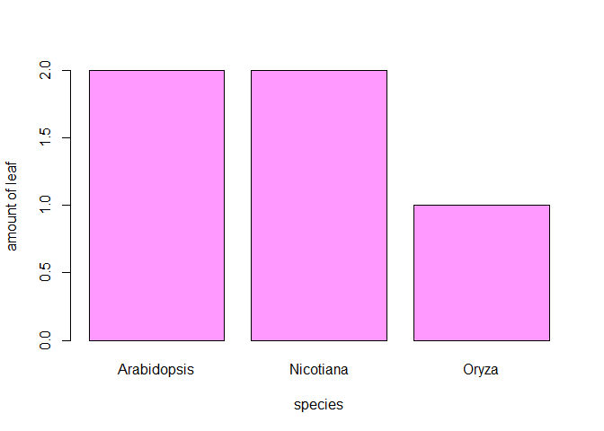
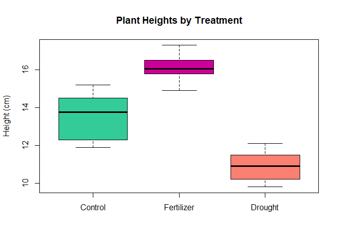
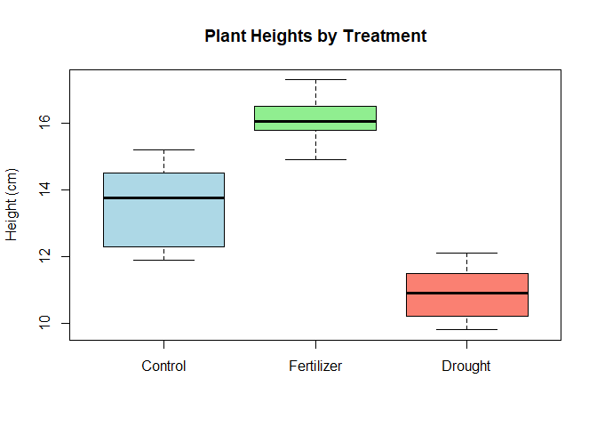

basciR
================
Hot
2025-05-02

การคำนวณใน R

``` r
1+1
```

    ## [1] 2

``` r
2*2
```

    ## [1] 4

``` r
4/2
```

    ## [1] 2

``` r
plant_height <-c(10.4,18.2)
plant_count <-c(4.5,2,3)
```

``` r
plant_height
```

    ## [1] 10.4 18.2

``` r
total_height <- c(plant_height * 2)
```

\#เปลี่ยนค่าตัวแปร

``` r
Plant_height <-plant_height+1000
```

``` r
weight <- 2.5
class(weight) #อยากรู้ว่าเป็นข้อมูลประเภทใด
```

    ## [1] "numeric"

``` r
species_name <- "Arabidopsis thaliana"
class(species_name)
```

    ## [1] "character"

``` r
count <- "10L"  # The L suffix creates an integer
count
```

    ## [1] "10L"

``` r
class(count)
```

    ## [1] "character"

``` r
heights <- c(10.2, 15.7, 12.3, 9.8, 11.5)
heights
```

    ## [1] 10.2 15.7 12.3  9.8 11.5

``` r
species <- c('Arabidopsis', 'Nicotiana', 'Oryza', 'Zea', 'Solanum')
species
```

    ## [1] "Arabidopsis" "Nicotiana"   "Oryza"       "Zea"         "Solanum"

``` r
heights[1]
```

    ## [1] 10.2

``` r
species[3]
```

    ## [1] "Oryza"

``` r
species[2:5]
```

    ## [1] "Nicotiana" "Oryza"     "Zea"       "Solanum"

``` r
species[c(2,5)] #อยากได้แค่บางคตัวให้'ใช้C
```

    ## [1] "Nicotiana" "Solanum"

``` r
species[-c(2,5)]
```

    ## [1] "Arabidopsis" "Oryza"       "Zea"

``` r
mean(heights)
```

    ## [1] 11.9

``` r
min(heights)
```

    ## [1] 9.8

``` r
max(heights)
```

    ## [1] 15.7

``` r
sum(heights)
```

    ## [1] 59.5

``` r
length(heights)
```

    ## [1] 5

``` r
treatments <- factor(c("Control", "Treatment A", "Treatment B", "Control", "Treatment A", "cat2"))
treatments
```

    ## [1] Control     Treatment A Treatment B Control     Treatment A cat2       
    ## Levels: cat2 Control Treatment A Treatment B

``` r
levels(treatments)
```

    ## [1] "cat2"        "Control"     "Treatment A" "Treatment B"

``` r
table(treatments) #เช็คในกลุ่มว่ามีกี่ตัว
```

    ## treatments
    ##        cat2     Control Treatment A Treatment B 
    ##           1           2           2           1

``` r
grade <-factor(c('A', 'B', 'C', 'A', 'D', 'F', 'A'))
grade
```

    ## [1] A B C A D F A
    ## Levels: A B C D F

``` r
table(grade)
```

    ## grade
    ## A B C D F 
    ## 3 1 1 1 1

``` r
grade_2 <-factor(grade, levels = c('A', 'B', 'C','D','E','F'))
grade_2
```

    ## [1] A B C A D F A
    ## Levels: A B C D E F

``` r
experiment <- data.frame(
  Plant_ID = 1:5,
  Species = c("Arabidopsis", "Arabidopsis", "Nicotiana", "Nicotiana", "Oryza"),
  Treatment = c("Control", "Drought", "Control", "Drought", "Control"),
  Height = c(10.2, 8.7, 15.3, 12.8, 25.4),
  Leaf_Count = c(8, 6, 12, 9, 7)
)

# View the data frame
experiment
```

    ##   Plant_ID     Species Treatment Height Leaf_Count
    ## 1        1 Arabidopsis   Control   10.2          8
    ## 2        2 Arabidopsis   Drought    8.7          6
    ## 3        3   Nicotiana   Control   15.3         12
    ## 4        4   Nicotiana   Drought   12.8          9
    ## 5        5       Oryza   Control   25.4          7

``` r
experiment$Plant_ID
```

    ## [1] 1 2 3 4 5

``` r
experiment[c(2,4,2:3)]
```

    ##       Species Height   Species.1 Treatment
    ## 1 Arabidopsis   10.2 Arabidopsis   Control
    ## 2 Arabidopsis    8.7 Arabidopsis   Drought
    ## 3   Nicotiana   15.3   Nicotiana   Control
    ## 4   Nicotiana   12.8   Nicotiana   Drought
    ## 5       Oryza   25.4       Oryza   Control

``` r
tmp<-experiment$Plant_ID
tmp
```

    ## [1] 1 2 3 4 5

``` r
tmp<-tmp+5
tmp
```

    ## [1]  6  7  8  9 10

``` r
experiment$Plant_ID<-tmp
experiment
```

    ##   Plant_ID     Species Treatment Height Leaf_Count
    ## 1        6 Arabidopsis   Control   10.2          8
    ## 2        7 Arabidopsis   Drought    8.7          6
    ## 3        8   Nicotiana   Control   15.3         12
    ## 4        9   Nicotiana   Drought   12.8          9
    ## 5       10       Oryza   Control   25.4          7

``` r
experiment$Plant_ID<-c(1,2,3,4,5)
experiment
```

    ##   Plant_ID     Species Treatment Height Leaf_Count
    ## 1        1 Arabidopsis   Control   10.2          8
    ## 2        2 Arabidopsis   Drought    8.7          6
    ## 3        3   Nicotiana   Control   15.3         12
    ## 4        4   Nicotiana   Drought   12.8          9
    ## 5        5       Oryza   Control   25.4          7

``` r
experiment[2,]
```

    ##   Plant_ID     Species Treatment Height Leaf_Count
    ## 2        2 Arabidopsis   Drought    8.7          6

``` r
experiment[2:4,2,3]
```

    ## [1] "Arabidopsis" "Nicotiana"   "Nicotiana"

``` r
experiment[,2:3]
```

    ##       Species Treatment
    ## 1 Arabidopsis   Control
    ## 2 Arabidopsis   Drought
    ## 3   Nicotiana   Control
    ## 4   Nicotiana   Drought
    ## 5       Oryza   Control

``` r
experiment[c(2:4)]
```

    ##       Species Treatment Height
    ## 1 Arabidopsis   Control   10.2
    ## 2 Arabidopsis   Drought    8.7
    ## 3   Nicotiana   Control   15.3
    ## 4   Nicotiana   Drought   12.8
    ## 5       Oryza   Control   25.4

experiment\[c(2,4),2:3\]

``` r
experiment[c(2,4),2:3]
```

    ##       Species Treatment
    ## 2 Arabidopsis   Drought
    ## 4   Nicotiana   Drought

``` r
summary(experiment)
```

    ##     Plant_ID   Species           Treatment             Height     
    ##  Min.   :1   Length:5           Length:5           Min.   : 8.70  
    ##  1st Qu.:2   Class :character   Class :character   1st Qu.:10.20  
    ##  Median :3   Mode  :character   Mode  :character   Median :12.80  
    ##  Mean   :3                                         Mean   :14.48  
    ##  3rd Qu.:4                                         3rd Qu.:15.30  
    ##  Max.   :5                                         Max.   :25.40  
    ##    Leaf_Count  
    ##  Min.   : 6.0  
    ##  1st Qu.: 7.0  
    ##  Median : 8.0  
    ##  Mean   : 8.4  
    ##  3rd Qu.: 9.0  
    ##  Max.   :12.0

``` r
experiment[2, 4]
```

    ## [1] 8.7

``` r
experiment[1:3, c("Species", "Height")]
```

    ##       Species Height
    ## 1 Arabidopsis   10.2
    ## 2 Arabidopsis    8.7
    ## 3   Nicotiana   15.3

``` r
# Create a list containing different types of data
plant_data <- list(
  id = "AT001",
  species = "Arabidopsis thaliana",
  heights = c(10.2, 11.5, 9.8),
  is_model_organism = TRUE,
  germination_rates = data.frame(
    temperature = c(20, 25, 30),
    rate = c(0.82, 0.95, 0.78)
  )
)

# Access list elements
plant_data$species
```

    ## [1] "Arabidopsis thaliana"

``` r
plant_data$heights
```

    ## [1] 10.2 11.5  9.8

``` r
plant_data$heights[3]
```

    ## [1] 9.8

``` r
plant_data$germination_rates
```

    ##   temperature rate
    ## 1          20 0.82
    ## 2          25 0.95
    ## 3          30 0.78

``` r
plant_age <- c(5, 10, 15, 20, 25, 30)
plant_size <- c(3.2, 8.5, 13.7, 18.2, 21.5, 24.8)
plot(plant_age, plant_size, 
     main = "การเจริญเติบโตของพืช",
     xlab = "อายุ(วัน)",
     ylab = "ความสูง(เซนติมตร)",
     col = "green",
     pch = 16)  # pch controls the point shape
```

<!-- -->

``` r
plot(experiment$Height,experiment$Leaf_Count, 
     main = "จำนวนใบ",
     xlab = "height",
     ylab = "amount of leaf",
     col = "red",
     pch = 16)  # pch controls the point shape
```

<!-- -->

``` r
barplot(experiment$Leaf_Count,names.arg = experiment$Species,
        xlab = "height",
        ylab = "amount of leaf",
     col = "darkblue")
```

<!-- -->

``` r
table(experiment$Species)
```

    ## 
    ## Arabidopsis   Nicotiana       Oryza 
    ##           2           2           1

``` r
tmp<-table(experiment$Species)
tmp
```

    ## 
    ## Arabidopsis   Nicotiana       Oryza 
    ##           2           2           1

``` r
names(tmp)
```

    ## [1] "Arabidopsis" "Nicotiana"   "Oryza"

``` r
barplot(tmp,names.arg = names(tmp),
        xlab = "species",
        ylab = "amount of leaf",
     col = "#FF99FF")
```

<!-- -->

``` r
treatment_A <- c(12.3, 14.5, 13.8, 15.2, 11.9, 13.7)
treatment_B <- c(15.8, 16.2, 14.9, 17.3, 16.5, 15.9)
treatment_C <- c(10.2, 11.5, 9.8, 10.5, 12.1, 11.3)
all_data <- list(
  "Control" = treatment_A,
  "Fertilizer" = treatment_B,
  "Drought" = treatment_C
)
boxplot(all_data,
        main = "Plant Heights by Treatment",
        ylab = "Height (cm)",
        col = c("#33CC99", "#CC0099", "salmon"))
```

<!-- -->

``` r
dat2<-data.frame(Control = treatment_A,
  Fertilizer = treatment_B,
  Drought = treatment_C)
# Create a boxplot
boxplot(dat2,
        main = "Plant Heights by Treatment",
        ylab = "Height (cm)",
        col = c("lightblue", "lightgreen", "salmon"))
```

<!-- -->

``` r
dat2
```

    ##   Control Fertilizer Drought
    ## 1    12.3       15.8    10.2
    ## 2    14.5       16.2    11.5
    ## 3    13.8       14.9     9.8
    ## 4    15.2       17.3    10.5
    ## 5    11.9       16.5    12.1
    ## 6    13.7       15.9    11.3

``` r
# Perform a t-test
t_test_result <- t.test(dat2$Fertilizer,dat2$Control)

# View the result
t_test_result
```

    ## 
    ##  Welch Two Sample t-test
    ## 
    ## data:  dat2$Fertilizer and dat2$Control
    ## t = 4.1511, df = 8.4347, p-value = 0.002855
    ## alternative hypothesis: true difference in means is not equal to 0
    ## 95 percent confidence interval:
    ##  1.138545 3.928121
    ## sample estimates:
    ## mean of x mean of y 
    ##  16.10000  13.56667

``` r
dat2
```

    ##   Control Fertilizer Drought
    ## 1    12.3       15.8    10.2
    ## 2    14.5       16.2    11.5
    ## 3    13.8       14.9     9.8
    ## 4    15.2       17.3    10.5
    ## 5    11.9       16.5    12.1
    ## 6    13.7       15.9    11.3

``` r
plant_growth <-data.frame(
  Height = c(dat2$Control, dat2$Fertilizer, dat2$Drought),
  treatment = factor(rep(c("Control", "Fertilizer", "Drought"), each = 6)))
plant_growth
```

    ##    Height  treatment
    ## 1    12.3    Control
    ## 2    14.5    Control
    ## 3    13.8    Control
    ## 4    15.2    Control
    ## 5    11.9    Control
    ## 6    13.7    Control
    ## 7    15.8 Fertilizer
    ## 8    16.2 Fertilizer
    ## 9    14.9 Fertilizer
    ## 10   17.3 Fertilizer
    ## 11   16.5 Fertilizer
    ## 12   15.9 Fertilizer
    ## 13   10.2    Drought
    ## 14   11.5    Drought
    ## 15    9.8    Drought
    ## 16   10.5    Drought
    ## 17   12.1    Drought
    ## 18   11.3    Drought

``` r
plant_growth$treatment
```

    ##  [1] Control    Control    Control    Control    Control    Control   
    ##  [7] Fertilizer Fertilizer Fertilizer Fertilizer Fertilizer Fertilizer
    ## [13] Drought    Drought    Drought    Drought    Drought    Drought   
    ## Levels: Control Drought Fertilizer

``` r
anova_result <- aov(Height ~ treatment, data = plant_growth)

# Summary of the ANOVA results
summary(anova_result)
```

    ##             Df Sum Sq Mean Sq F value   Pr(>F)    
    ## treatment    2  81.14   40.57   40.59 8.87e-07 ***
    ## Residuals   15  14.99    1.00                     
    ## ---
    ## Signif. codes:  0 '***' 0.001 '**' 0.01 '*' 0.05 '.' 0.1 ' ' 1

``` r
tukey_result <- TukeyHSD(anova_result)
tukey_result
```

    ##   Tukey multiple comparisons of means
    ##     95% family-wise confidence level
    ## 
    ## Fit: aov(formula = Height ~ treatment, data = plant_growth)
    ## 
    ## $treatment
    ##                         diff       lwr       upr     p adj
    ## Drought-Control    -2.666667 -4.165984 -1.167350 0.0009157
    ## Fertilizer-Control  2.533333  1.034016  4.032650 0.0014425
    ## Fertilizer-Drought  5.200000  3.700683  6.699317 0.0000006
